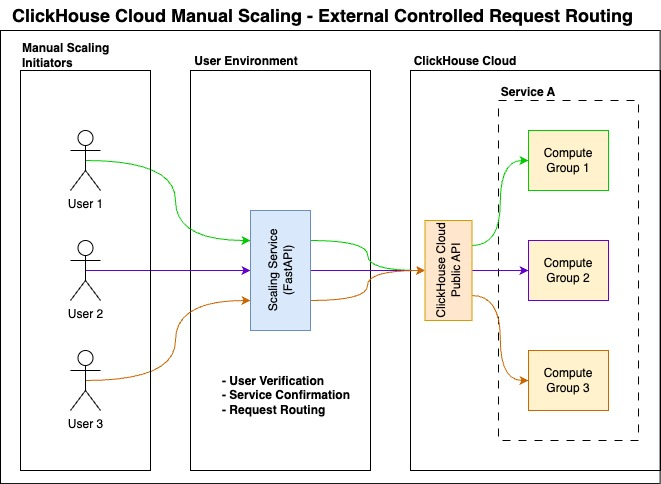

# ClickHouse Cloud Compute Group Scaling Service

This is an example service designed to demonstrate how to set up an external mechanism for allowing users to scale specific compute groups within a ClickHouse Cloud Service.

Currently, user access in ClickHouse Cloud is managed at the Service level. However, in scenarios where you have set up a ClickHouse Cloud Warehouse (Compute-Compute Separation) and need to grant users of individual compute groups the ability to manage their own scaling, this must be handled externally.

This project provides a working implementation of such a mechanism. It ensures that multiple users can securely initiate scaling requests while maintaining proper authentication and authorization controls.

## Key features:

- Uses FastAPI to build secure API endpoints for user verification, service confirmation, and request routing.
- Ensures controlled access to scaling operations while maintaining security best practices.
- Demonstrates a practical approach to handling compute group scaling in ClickHouse Cloud.

This repository serves as a reference implementation, enabling you to adapt and extend it according to your specific requirements.



## Prerequisites

- Python 3.13 or higher
- Access to ClickHouse Cloud services
- IP Access List enabled on the ClickHouse Cloud services
- ClickHouse Cloud API credentials
- UV package manager (`pip install uv`)

## Installation

1. Clone the repository:

```bash
git clone https://github.com/maruthiprithivi/clickhouse_warehouse_manual_scaling
cd ch_warehouse_manual_scaling
```

2. Create and activate a Python virtual environment:

```bash
uv venv
source .venv/bin/activate  # On Windows, use `.venv\Scripts\activate`
```

3. Install dependencies using UV:

```bash
uv sync
```

4. Install development dependencies (optional):

```bash
uv sync --only-dev
```

## Configuration

1. Copy the environment template:

```bash
cp configs/.env_template configs/.env
```

2. Update the `.env` file with your ClickHouse credentials:

```env
CLICKHOUSE_API_KEY=<your_api_key>
CLICKHOUSE_API_SECRET=<your_api_secret>
CLICKHOUSE_ORGANIZATION_ID=<your_org_id>
CLICKHOUSE_FAST_API_USERNAME=<api_username>
CLICKHOUSE_FAST_API_PASSWORD=<api_password>
CLICKHOUSE_FAST_API_PORT=8000
CLICKHOUSE_FAST_API_HOST=0.0.0.0
CLICKHOUSE_FAST_API_DOCS_PATH=/clickhouse/manual/scaling/docs
```

3. Configure organization settings in `configs/org_config.yaml`:

```yaml
cp configs/org_config.yaml_template configs/org_config.yaml
# Edit the file according to your organization's needs
```

## Running the Service

1. Start the FastAPI service:

```bash
make dev
```

2. Access the API documentation:

```
http://localhost:8000/clickhouse/manual/scaling/docs
```

## Development

### Code Quality

The project uses several tools to maintain code quality:

1. Install pre-commit:

```bash
uv add --dev pre-commit
```

2. Install pre-commit hooks:

```bash
pre-commit install
```

2. Run code formatting and linting:

```bash
make pre-commit
```

## API Endpoints

The service provides the following main endpoints:

### `POST /scaling`

Initiate a scaling request for a ClickHouse service.

**Request Payload:**

```json
{
  "service_id": "string",
  "username": "string",
  "password": "string",
  "min_memory_gb": 16,
  "max_memory_gb": 32,
  "num_replicas": 1,
  "idle_scaling": true,
  "idle_timeout_minutes": 30
}
```

**Payload Constraints:**

- `min_memory_gb`: Must be one of the predefined RAM options (e.g., 16, 32, 64)
- `max_memory_gb`: Must be one of the predefined RAM options, greater than or equal to `min_memory_gb`
- `num_replicas`: OPTIONAL, must be from predefined REPLICAS options
- `idle_scaling`: OPTIONAL, default is true. This setting will automatically scale the service down when it is idle for the specified timeout.
- `idle_timeout_minutes`: OPTIONAL, minimum value of 5 minutes

**Example Request:**

```bash
curl -X POST http://localhost:8000/scaling \
     -H "Content-Type: application/json" \
     -d '{
         "service_id": "your-service-id",
         "username": "service-username",
         "password": "service-password",
         "min_memory_gb": 16,
         "max_memory_gb": 32,
         "num_replicas": 1,
         "idle_scaling": true,
         "idle_timeout_minutes": 30
     }'
```

**Response:**

```json
{
  "message": "Service configuration updated successfully."
}
```

### `GET /service/state`

Get the current state of the ClickHouse service.

**Query Parameters:**

- `service_id`: Unique identifier of the service
- `username`: Service username
- `password`: Service password

**Example Request:**

```bash
curl "http://localhost:8000/service/state?service_id=your-service-id&username=service-username&password=service-password"
```

**Response:**

```json
{
  "state": "running"
}
```

### `GET /service/config`

Get the current configuration of the ClickHouse service.

**Query Parameters:**

- `service_id`: Unique identifier of the service
- `username`: Service username
- `password`: Service password

**Example Request:**

```bash
curl "http://localhost:8000/service/config?service_id=your-service-id&username=service-username&password=service-password"
```

**Response:**

```json
{
  "minReplicaMemoryGb": 16,
  "maxReplicaMemoryGb": 32,
  "idleScaling": true,
  "idleTimeoutMinutes": 30,
  "numReplicas": 1
}
```

### `GET /service/ip-access-list`

Get the current IP access list of the ClickHouse service.

**Query Parameters:**

- `service_id`: Unique identifier of the service
- `username`: Service username
- `password`: Service password

**Example Request:**

```bash
curl "http://localhost:8000/service/ip-access-list?service_id=your-service-id&username=service-username&password=service-password"
```

**Response:**

```json
{
  "ipAccessList": [
    {
      "source": "192.168.1.0",
      "description": "Office Network"
    }
  ]
}
```

### `GET /service/details`

Get the complete details of the ClickHouse service.

**Query Parameters:**

- `service_id`: Unique identifier of the service
- `username`: Service username
- `password`: Service password

**Example Request:**

```bash
curl "http://localhost:8000/service/details?service_id=your-service-id&username=service-username&password=service-password"
```

**Response:**

```json
{
  "result": {
    "id": "xxxxxxxx-xxxx-xxxx-xxxx-xxxxxxxxxxxx",
    "name": "Service 01",
    "provider": "xxx",
    "region": "xxxxxxxx-1",
    "state": "running",
    "endpoints": [
      {
        "protocol": "nativesecure",
        "host": "000000000000.xxxxxxxx-1.xxx.clickhouse.cloud",
        "port": 9440
      },
      {
        "protocol": "https",
        "host": "000000000000.xxxxxxxx-1.xxx.clickhouse.cloud",
        "port": 8443
      }
    ],
    "idleScaling": true,
    "idleTimeoutMinutes": 33,
    "minTotalMemoryGb": 48,
    "maxTotalMemoryGb": 96,
    "minReplicaMemoryGb": 16,
    "maxReplicaMemoryGb": 32,
    "numReplicas": 3,
    "ipAccessList": [
      {
        "source": "1.1.1.1",
        "description": "Sample IP 1"
      },
      {
        "source": "2.2.2.2",
        "description": "Sample IP 2"
      }
    ],
    "createdAt": "2099-12-20T06:34:11Z",
    "iamRole": "arn:aws:iam::000000000000:role/XX-XX-XXXXXX-XX-XX-XX-XX-Role",
    "privateEndpointIds": [],
    "dataWarehouseId": "00000000-0000-0000-0000-000000000000",
    "isPrimary": true,
    "isReadonly": false,
    "releaseChannel": "default"
  },
  "requestId": "00000000-0000-0000-0000-000000000000",
  "status": 200
}
```

For detailed API documentation with interactive testing, visit the Swagger UI at `/clickhouse/manual/scaling/docs` when the service is running.

## Security

- All API endpoints are protected with authentication
- Environment variables are used for sensitive configuration
- Request validation ensures data integrity
- User verification is required for scaling operations

## Contributing

1. Fork the repository
2. Create a feature branch
3. Commit your changes
4. Make sure to add a summary of the changes you made
5. Push to the branch
6. Create a Pull Request

## Support

For support, please [create an issue](https://github.com/maruthiprithivi/clickhouse_warehouse_manual_scaling/issues) in the repository.
